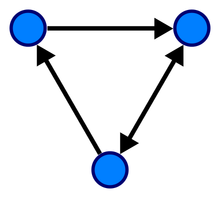
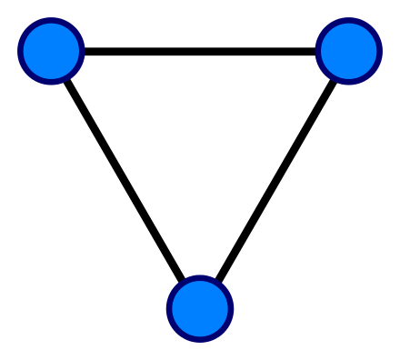
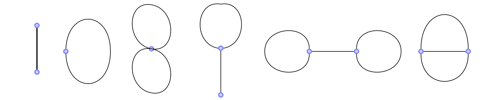
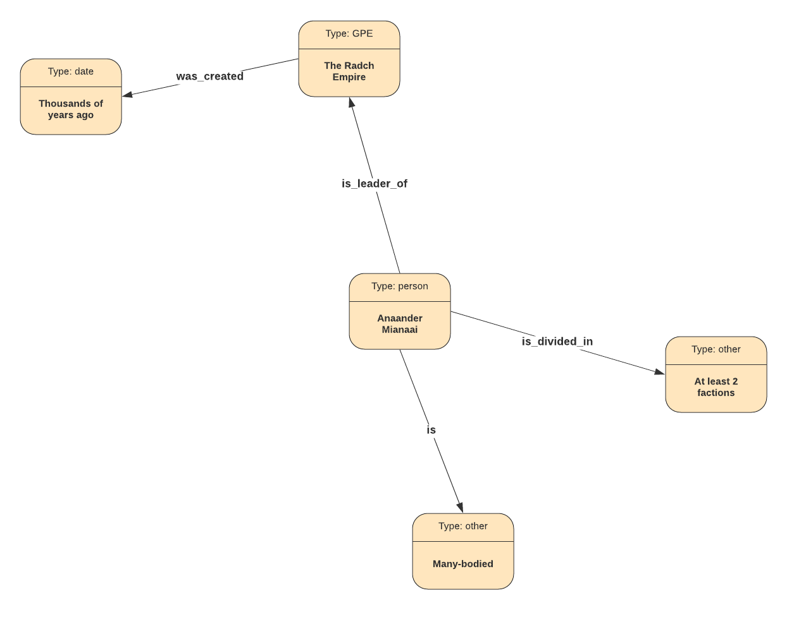

# Graphs for Data Science
@snap[east span-100]
### nushki mamatelashvili 
@snapend

@snap[south-east span-30]
25 February, 2020
@snapend

@snap[south-west span-40]
@nushkee @EliizaAI
@snapend


---
@snap[midpoint span-50]
# A bit about me 
@snapend

---

# Graphs

<br>

- Nodes/vertices
- Connected with edges/relations

- Edges can have direction 
  
@snap[south-west span-40]

@snapend

@snap[south-east span-40]

@snapend

---

# Graphs

<br>

- There can be multiple edges between nodes
  
@snap[west span-40]

@snapend

- Edges can have weights. 

---

# Seven Bridges of Königsberg


@snap[center span-70]

@snapend


---

# Seven Bridges of Königsberg as a graph


@snap[center span-70]

@snapend
 
---
# n-ac Graphs

A graph is called n-arc-connected if for any n points on the graph there is a path through all the points. 


The following are equivalent for a graph G ([paper](https://arxiv.org/abs/1209.5451)): 
- G is n-ac for all n 
- G is 7-ac
- G is one of

@snap[south span-70]

@snapend

---

# Theorems

Wagner's theorem is a mathematical forbidden graph characterization of planar graphs, named after Klaus Wagner, stating that a finite graph is planar if and only if its minors include neither K5 (the complete graph on five vertices) nor K3,3 (the utility graph, a complete bipartite graph on six vertices). 

Mantel's Theorem. The maximum number of edges in an n-vertex triangle-free graph is 
⌊n2 / 4 ⌋
.
`\[\lfloor n^2/4 \rfloor\]`. (Mantel 1907)

@math
`\[
\left( \sum_{k=1}^n a_k b_k \right)^{\!\!2} \leq
 \left( \sum_{k=1}^n a_k^2 \right) \left( \sum_{k=1}^n b_k^2 \right)
\]`
@mathend

In graph theory, Robbins' theorem, named after Herbert Robbins (1939), states that the graphs that have strong orientations are exactly the 2-edge-connected graphs. That is, it is possible to choose a direction for each edge of an undirected graph G, turning it into a directed graph that has a path from every vertex to every other vertex, if and only if G is connected and has no bridge.


In combinatorial mathematics, Ramsey's theorem, in one of its graph-theoretic forms, states that one will find monochromatic cliques in any edge labelling (with colours) of a sufficiently large complete graph. To demonstrate the theorem for two colours (say, blue and red), let r and s be any two positive integers.[1] Ramsey's theorem states that there exists a least positive integer R(r, s) for which every blue-red edge colouring of the complete graph on R(r, s) vertices contains a blue clique on r vertices or a red clique on s vertices. (Here R(r, s) signifies an integer that depends on both r and s.)


Ore's theorem is a result in graph theory proved in 1960 by Norwegian mathematician Øystein Ore. It gives a sufficient condition for a graph to be Hamiltonian, essentially stating that a graph with sufficiently many edges must contain a Hamilton cycle. Specifically, the theorem considers the sum of the degrees of pairs of non-adjacent vertices: if every such pair has a sum that at least equals the total number of vertices in the graph, then the graph is Hamiltonian.


 Menger's theorem says that in a finite graph, the size of a minimum cut set is equal to the maximum number of disjoint paths that can be found between any pair of vertices.
 
 lower and upper bounds on number of colors
 
 number of spanning trees can be computed in polynomial time 
 
 
 Grötzsch's theorem is the statement that every triangle-free planar graph can be colored with only three colors
 
 
  the four color theorem, or the four color map theorem, states that, given any separation of a plane into contiguous regions, producing a figure called a map, no more than four colors are required to color the regions of the map so that no two adjacent regions have the same color.  the theorem states that for loopless planar 
G
G, the chromatic number of its dual graph is <= 4. 

In graph theory, the De Bruijn–Erdős theorem relates graph coloring of an infinite graph to the same problem on its finite subgraphs. It states that, when all finite subgraphs can be colored with 
c
c colors, the same is true for the whole graph.

According to the theorem, in a connected graph in which every vertex has at most Δ neighbors, the vertices can be colored with only Δ colors, except for two cases, complete graphs and cycle graphs of odd length, which require Δ + 1 colors.

In computer science and optimization theory, the max-flow min-cut theorem states that in a flow network, the maximum amount of flow passing from the source to the sink is equal to the total weight of the edges in the minimum cut, i.e. the smallest total weight of the edges which if removed would disconnect the source from the sink.
 

---

# Knowledge Graphs 

The Radch Empire was created thousands of years ago. <br>
Its leader is Anaander Mianaai. <br>
She's many-bodied and divided in at least 2 factions.


@snap[south span-50]

@snapend

--- 
# Stanford [CoreNLP](https://stanfordnlp.github.io/CoreNLP/) for R
By Christopher Manning, Mihai Surdeanu, John Bauer, Jenny Finkel, Steven Bethard, David McClosky

<br>

```r
downloadCoreNLP()
initCoreNLP(type='english_all')
```

- Needs a lot of memory 
- Depends on Java


---
@snap[west span-100]
# Thank you! 
@snapend

