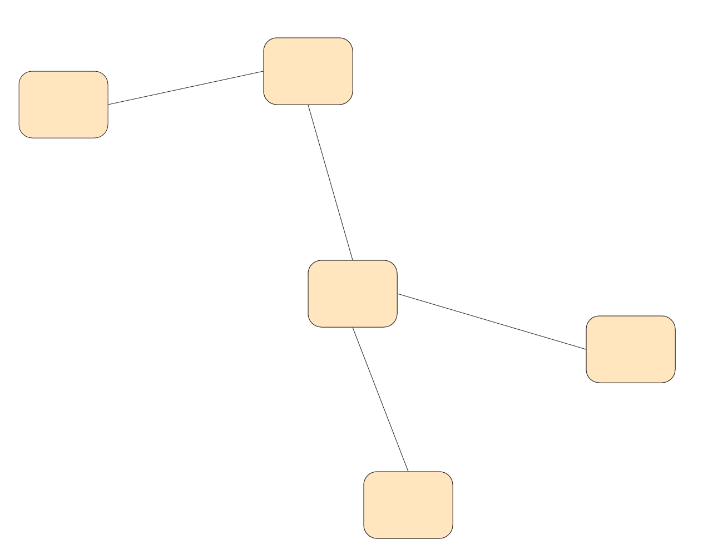
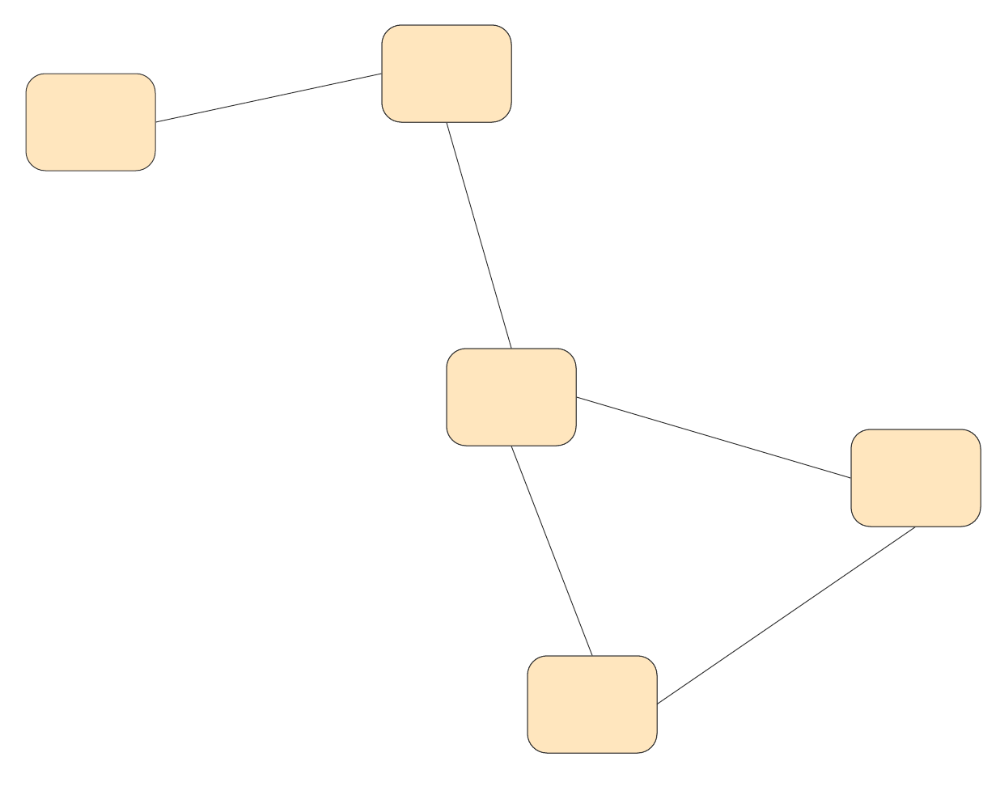

# Graphs for Data Science
@snap[east span-100]
### nushki Mamatelashvili 
@snapend

@snap[south-east span-30]
25 February, 2020
@snapend

@snap[south-west span-40]
@nushkee @EliizaAI
@snapend


---
@snap[midpoint span-50]
# A bit about me 
@snapend

---

# Graphs

<br>

- Nodes
- Connected with edges 
  
@snap[south-west span-40]

@snapend

@snap[south-east span-40]

@snapend
 
---

# Knowledge Graphs 

The Radch Empire was created thousands of years ago. <br>
Its leader is Anaander Mianaai. <br>
She's many-bodied and divided in at least 2 factions.


@snap[south span-50]

@snapend

--- 
# Stanford [CoreNLP](https://stanfordnlp.github.io/CoreNLP/) for R
By Christopher Manning, Mihai Surdeanu, John Bauer, Jenny Finkel, Steven Bethard, David McClosky

<br>

```r
downloadCoreNLP()
initCoreNLP(type='english_all')
```

- Needs a lot of memory 
- Depends on Java


---
@snap[west span-100]
# Thank you! 
@snapend

