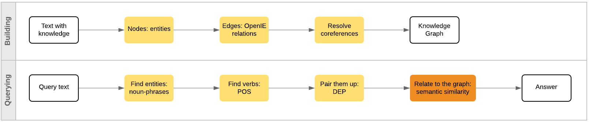

# Graphs theory in Data Science
@snap[east span-100]
### nushki mamatelashvili 
@snapend

@snap[south-east span-30]
13 August, 2020
@snapend

@snap[south-west span-40]
@nushkee @EliizaAI
@snapend


---
@snap[midpoint span-50]
# A bit about me 
@snapend

---

# Graphs

Used to structure entities and objects and study relationships between them. 

A graph is a pair of sets G = (V,E).  

<br>

- V is the set of nodes/vertices corresponding with the objects 
- E is the set of edges corresponding with the relations  
- Undirected graph: V = {A, B, C}, E = {(A,B), (B,C), (C,A)}
- Directed graph: V = {A, B, C}, E = {(A,B), (B,C), (C,B), (C,A)}
- There can be multiple edges between nodes 
- Edges can have weights 
  
@snap[south-east span-20]

@snapend

@snap[east span-20]

@snapend

---


@snap[midpoint span-70]
# Data with graph structure
@snapend

--- 

# Networks: 

<br>

- Pandemic spread
- Social networds
- Infrastructure grids: energy grids, roads, airports  


---

# Text

@snap[midpoint span-50]

@snapend

---

# Tools

<br>

- Python packages: NetworkX
- Graph databases: neo4j, GRAKN
---


@snap[midpoint span-70]
# Data that can be processed to uncover it's graph structure
@snapend


---

# Knowledge Graphs 

The Radch Empire was created thousands of years ago. <br>
Its leader is Anaander Mianaai. <br>
She's many-bodied and divided in at least 2 factions.


@snap[south span-50]

@snapend


---

# Workflow for KG

@snap[midpoint span-100]

@snapend
  
---
# Nodes: Entities 
## (spaCy)
@snap[north-east span-50]

@snapend

The Radch Empire was created thousands of years ago. <br>
Its leader is Anaander Mianaai. <br>
She's many-bodied and divided in at least 2 factions.

<br>
```r
                 entity entity_type
       The_Radch_Empire         GPE
 thousands_of_years_ago        DATE
       Anaander_Mianaai      PERSON
             at_least_2    CARDINAL
```
---
# Edges: relations 
## (CoreNLP Open IE)

@snap[north-east span-50]

@snapend

The Radch Empire was created thousands of years ago. <br>
Its leader is Anaander Mianaai. <br>
She's many-bodied and divided in at least 2 factions.

<br>


```r
      subject    relation                 object
 Radch Empire was created     thousands of years
 Radch Empire was created thousands of years ago
 Radch Empire was created              thousands
   Its leader          is       Anaander Mianaai
          She  divided in    at least 2 factions
          She         has            many-bodied
```
---
# Ambiguities: Coreference Resolution 
## (CoreNLP Open IE)

@snap[north-east span-50]
<br>

@snapend

The Radch Empire was created thousands of years ago. <br>
Its leader is Anaander Mianaai. <br>
She's many-bodied and divided in at least 2 factions.

<br>

Two coreference clusters:
1. The Radch Empire, Its
2. Anaander Mianaai, Its leader, She  

---

@snap[midpoint span-70]

@snapend


@snap[south span-100]
### How do we query a knowledge graph? 
@snapend


---
# Find entities: noun phrases 
## (spaCy)


@snap[north-east span-50]
<br>

@snapend

When was the Radch Empire founded?

<br>
<br>


```r
       nounphrase
 the_Radch_Empire
```

---
# Find verbs: parts of speech 
## (spaCy)

@snap[north-east span-50]
<br>

@snapend

When was the Radch Empire founded?

<br>
<br>
```r
 sentence_id token_id   token   pos  tag
           1        1    When   ADV  WRB
           1        2     was  VERB  VBD
           1        3     the   DET   DT
           1        4   Radch PROPN NNPS
           1        5  Empire PROPN  NNP
           1        6 founded  VERB  VBD
           1        7       ? PUNCT    .
```

---
# Pair them up: dependencies 
## (spaCy)

@snap[north-east span-50]
<br>

@snapend

When was the Radch Empire founded?

<br>
<br>

```r
 sentence_id token_id   token head_token_id  dep_rel
           1        1    When             6   advmod
           1        2     was             6  auxpass
           1        3     the             5      det
           1        4   Radch             5 compound
           1        5  Empire             6    nsubj
           1        6 founded             6     ROOT
           1        7       ?             6    punct
```

---
@snap[midpoint span-100]
 
@snapend


---
# Relate to the KG: word embeddings 
## (spaCy, GloVe)

@snap[north-east span-50]
<br>

@snapend
founded created leader is divided
<br>


```r
   token has_vector vector_norm
 founded       TRUE    6.329316
 created       TRUE    5.515051
  leader       TRUE    6.531607
      is       TRUE    4.890306
 divided       TRUE    5.766988
```
---

# Relate to the KG: semantic similarity 
## (spaCy)

<br>


Cosine similarity scores between:

- founded and created: 0.4530104
- founded and leader: 0.4157298


@snap[east span-50]

@snapend


--- 
# When was the Radch Empire founded?


@snap[east span-65]

@snapend


@snap[south-east span-100]
### Thousands of years ago.
@snapend

---

# Seven Bridges of Königsberg


@snap[midpoint span-70]

@snapend


---

# Seven Bridges of Königsberg 
### as a graph


@snap[midpoint span-70]

@snapend
 
---
# n-ac Graphs

A graph is called n-arc-connected if for any n points on the graph there is a path through all the points that does not self-intersect. 

<br>

The following are equivalent for a graph G ([paper](https://arxiv.org/abs/1209.5451)): 
- G is n-ac for all n 
- G is 7-ac
- G is one of

@snap[south span-70]

@snapend

---

# Information 
# Extraction 


@snap[east span-50]

@snapend

---

@snap[west span-50] 
# Information 
# Extraction

<br>

### Connected 
### Components

<br>


@snapend


@snap[east span-50]

<br>

@snapend


---

@snap[midpoint span-50]

@snapend

---

# PageRank

@snap[midpoint span-70]

@snapend

--- 

# Summariser for slack

@snap[midpoint span-65]

@snapend

---

# Other Algorithms


- Graph coloring
 - Plethora of theorems with lower and upper bounds on number of colours. 
- Cliques 
 - Mantel's Theorem giving the maximum number of edges in an n-vertex triangle-free graph. 
 - Ramsey's theorem asserting existence of monochromatic cliques in any edge collouring of a sufficiently large complete graph. 
- Shortest paths
- Minimum spanning tree
- Planar graphs
 - Wagner's theorem giving a forbidden characterisation of planar graphs.  
- Cut sets and connectivity 
 - Menger's theorem relating the size of a minimum cut set and the maximum number of disjoint paths that can be found between any pair of vertices.
 - The max-flow min-cut theorem relating the maximum amount of flow passing through a graph and the total weight of the edges in the minimum cut. 

---
@snap[west span-100]
# Thank you! 
@snapend


