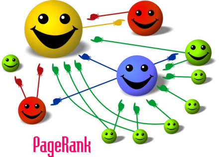

# Graphs for Data Science
@snap[east span-100]
### nushki mamatelashvili 
@snapend

@snap[south-east span-30]
25 February, 2020
@snapend

@snap[south-west span-40]
@nushkee @EliizaAI
@snapend

---
@snap[midpoint span-50]
# A bit about me 
@snapend

---

# Graphs

 

- Nodes/vertices

- Connected with edges/relations

 

- Edges can have direction 

- There can be multiple edges between nodes
 
- Edges can have weights. 
  
@snap[south-east span-40]

@snapend

@snap[north-east span-40]

@snapend

---

@snap[midpoint span-70]
# Data with graph structure
@snapend

---

# Text

@snap[midpoint span-50]

@snapend

---

# Knowledge Graphs 

The Radch Empire was created thousands of years ago.  
Its leader is Anaander Mianaai.  
She's many-bodied and divided in at least 2 factions.

@snap[south span-50]

@snapend

--- 

# Networks: 

 

- Social networds
- Infrastructure grids: energy grids, roads
- Epidemic spread

---

# Tools

 

- NetworkX
- Graph databases: neo4j, GRAKN

---

# Seven Bridges of Königsberg

@snap[midpoint span-70]

@snapend

---

# Seven Bridges of Königsberg 
### as a graph

@snap[midpoint span-70]

@snapend
 
---
# n-ac Graphs

A graph is called n-arc-connected if for any n points on the graph there is a path through all the points that does not self-intersect. 

 

The following are equivalent for a graph G ([paper](https://arxiv.org/abs/1209.5451)): 
- G is n-ac for all n 
- G is 7-ac
- G is one of

@snap[south span-70]

@snapend

---

# Information 
# Extraction 

@snap[east span-50]

@snapend

---

@snap[west span-50] 
# Information 
# Extraction

 

### Connected 
### Components

 

@snapend

@snap[east span-50]

 

@snapend

---

@snap[midpoint span-50]

@snapend

---

# PageRank

@snap[midpoint span-70]

@snapend

--- 

# Summariser for slack

@snap[midpoint span-65]

@snapend

---

# Other Algorithms

- Graph coloring
 - lower and upper bounds on number of colors
 - Grötzsch's theorem: every triangle-free planar graph can be colored with only three colors
 - The four color theorem
- Cliques 
 - Mantel's Theorem: The maximum number of edges in an n-vertex triangle-free graph is `\[\lfloor n^2/4 \rfloor\]`. 
 - Ramsey's theorem: there is a monochromatic cliques in any edge labelling (with colours) of a sufficiently large complete graph. 
- Shortest paths
- Minimum spanning tree
 - Number of spanning trees can be computed in polynomial time 
- Planar graphs
 - Wagner's theorem: a finite graph is planar if and only if its minors include neither K5 (the complete graph on five vertices) nor K3,3 (the utility graph, a complete bipartite graph on six vertices). 
- Cut sets and connectivity 
 - Menger's theorem: in a finite graph, the size of a minimum cut set is equal to the maximum number of disjoint paths that can be found between any pair of vertices.
 - The max-flow min-cut theorem: the maximum amount of flow passing from the source to the sink is equal to the total weight of the edges in the minimum cut, i.e. the smallest total weight of the edges which if removed would disconnect the source from the sink.

---

---
@snap[west span-100]
# Thank you! 
@snapend

